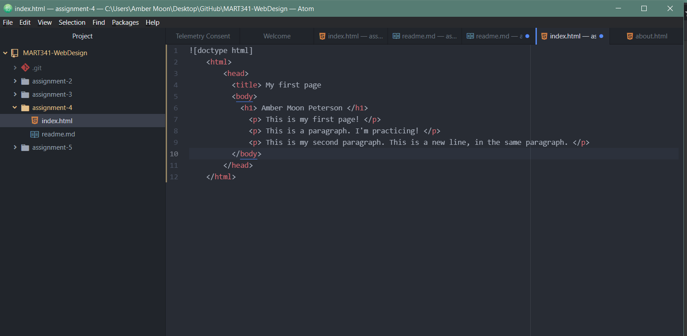

MART 341 assignment 4

1. Browsers are a program through which we access the internet.

2. Markup language is what defines elements within a document, it's the web's language! HTML is the most commonly used markup language, and is used to display document nodes, as well as render content and page structure.

Screenshot of my Directory
