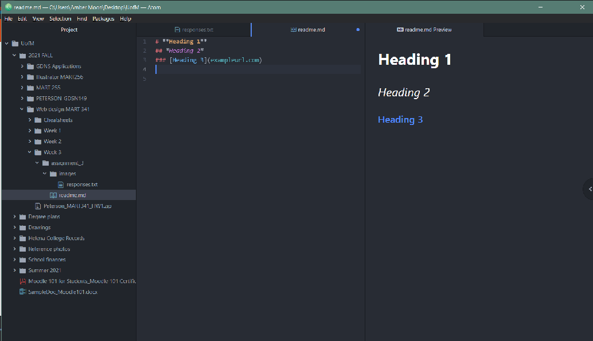

# **Assignment 3**
## *Amber Moon Peterson*
### Three things I've learned so far
1. Markdown elements- how to use code to affect the appearance and organization of text

2. What the internet is and how it works (sort of). The internet is the connection between computers and devices, and the web is all the data (websites) that travels along those connections via packages of bits.

3. Http is the language used to communicate between web browsers and servers, html tells a web browser how to make a page look. There are so many parts of how information is communicated on the internet!

I'm writing a test paragraph so I can practice the thing and make sure my text wraps. It does!

[Link to website of my choice: Nederlands Dans Theater](https://www.ndt.nl/en/)

[My responses](./responses.txt)

"Screenshot of HW progress on Atom"
